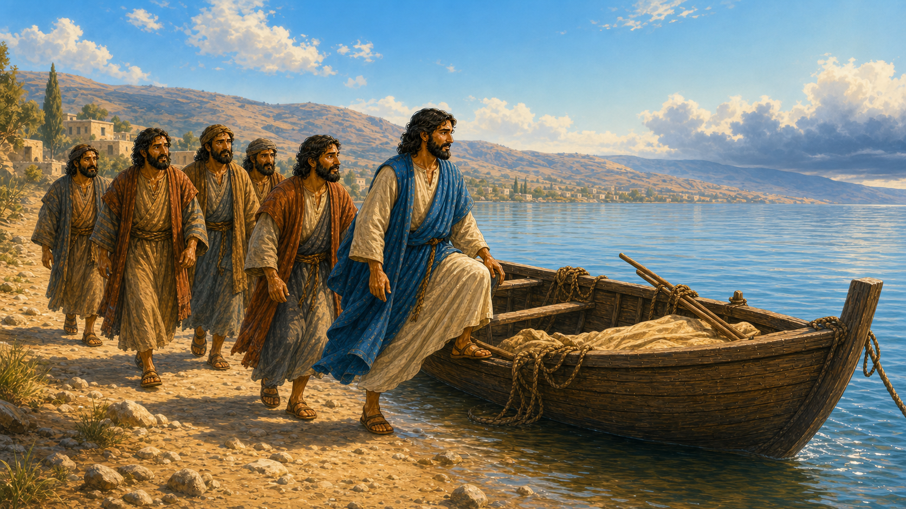
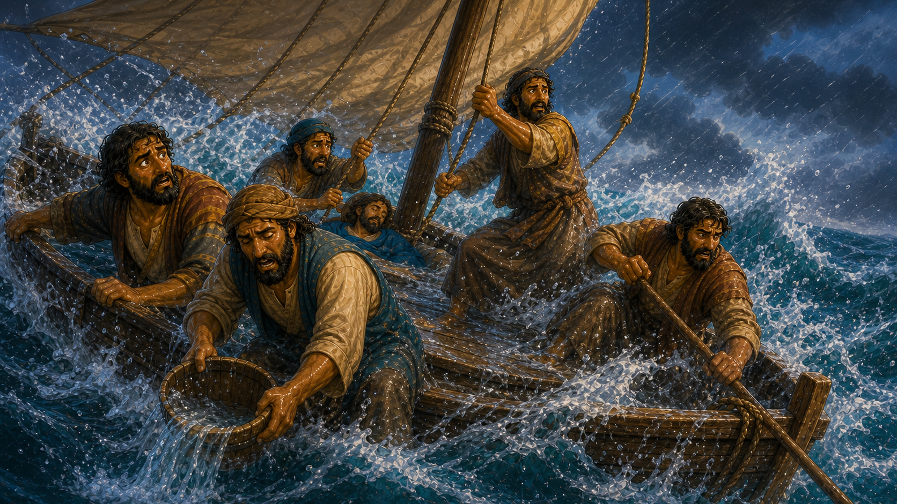
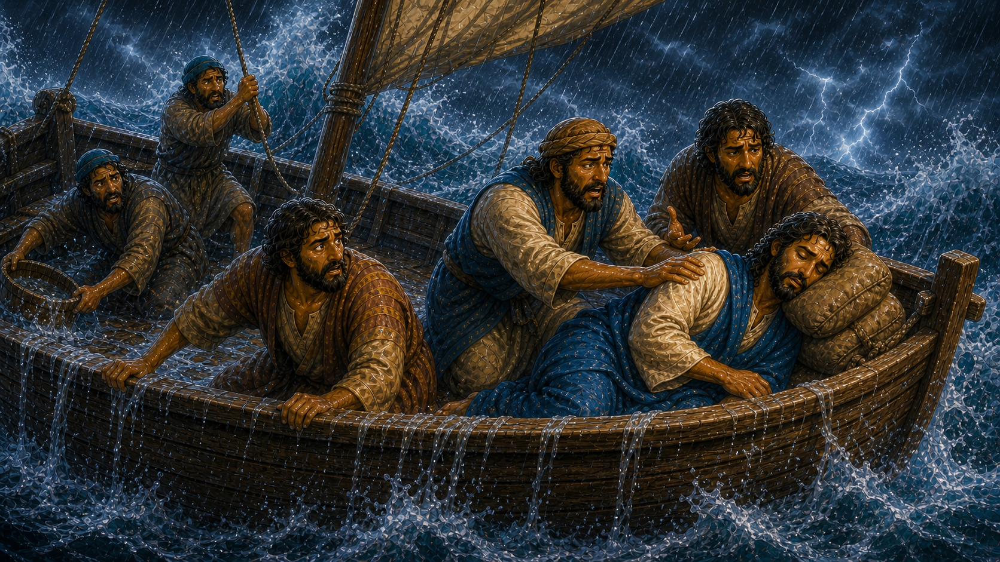
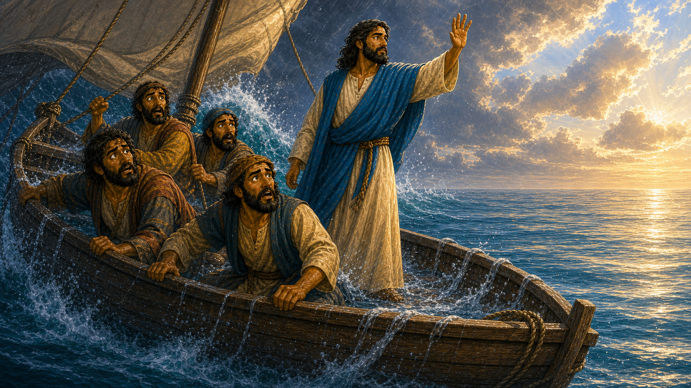
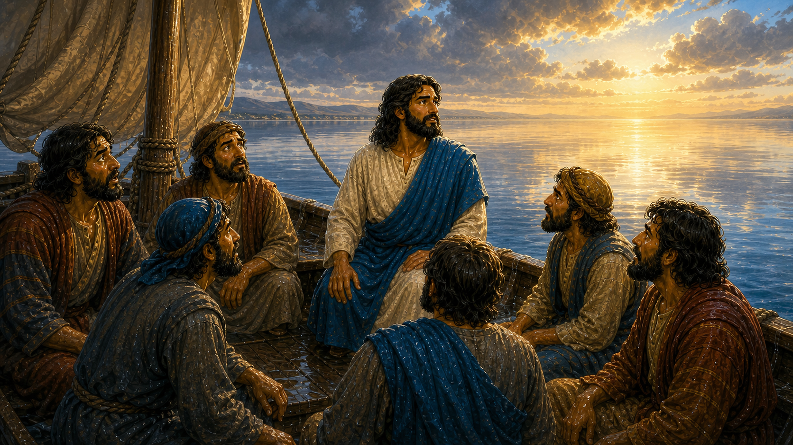

# A Flooded Boat

## Lesson Brief

- **Series:** Adventures in the Bible
- **Subject/Theme:** Trusting Jesus when life feels scary
- **Bible Focus:** The story of Jesus calming the storm
- **Main Passage:** Matthew 8:23-27
- **Main Point:** Jesus has power over every storm, so we can trust Him when we are afraid.

## Memory Verse
> **Matthew 8:27**
> But the men marvelled, saying, What manner of man is this, that even the winds and the sea obey him!

## Lesson Outline

We are at a part of a story of Jesus where he recently began teaching his disciples.His disciples had only just started following him not too long ago. Even though they knew that he was the Messiah, that he was the Son of God, they still saw him as a man, a teacher, a person of great wisdom. They didn’t really know what he was capable of, the great and mighty miracles that he was going to perform. 

Here Jesus had recently finished preaching and teaching and performing miracles for the day. They were getting ready to get into a ship to cross the Sea of Galilee.

### 1. Into The Ship With Jesus
> **Matthew 8:23**
And when he was entered into a ship, his disciples followed him.

**Summary/Lesson:** Picture the edge of the Sea of Galilee. Jesus steps into a ship, and the disciples climb in after Him.
>Let the children pretend to step over the side, find a seat, and begin rowing.
The water moves beneath the boat, the shore slips farther away, and everything is just fine. It’s a beautiful peaceful day on the water. No huge groups of people, no screaming crazy person, no one throwing rocks. Most importantly, Jesus is in the ship with them.

> Let the peaceful beginning make the sudden danger feel even greater.
This is the disciples happy place. They are with Jesus, without any other people around. Instead of tending to everyone else’s needs, they are able to talk to Jesus themselves and ask questions and let Him help them. They get to talk with their master.

### 2. Without Warning, The Storm Struck
> **Matthew 8:24a**
And, behold, there arose a great tempest in the sea, insomuch that the ship was covered with the waves…

**Summary/Lesson:** after being out at sea for a few hours, clouds started forming over the horizon. It started to get dark. The wind picked up, but at this point it was too late. 

> **Illustration:** Have the children create the storm with you: rub hands for wind, pat knees for rain, stomp for thunder, and then BOOM! lightning!

They were already too far from shore to turn back. The wind started beating against the boat. Waves crashed over the side and were tossed to and fro. The calm trip is over. Matthew calls it "a great tempest in the sea." 

> Make the sound of a low wind and invite the children to join you. Let it grow louder. Rock from side to side. The boat rises, drops, and tilts. Then a wave crashes over the side. The disciples are wet, the deck is slippery, and the ship is being covered by the waves.

The ship rose with the high waves and crashed down on the other side. They started were scared and they began fearing for their lives. Even though some of the disciples, like Peter and Andrew and James and John, had experience working on the boats in the sea, this storm was too big for them. 

That is what makes their fear so important. If men who knew boats and storms believed they were about to die, this was no small rain cloud. They knew what to do in ordinary trouble, but everything they knew was not enough. They could work hard, but they could not command the storm.
> “If even these experienced fishermen thought they were going to die, how terrible must this storm have been?"

### 3. The One Person Who Could Help Was Asleep

**Summary/Lesson:** The waves are covering the ship—but where is Jesus?
> **Matthew 8:24-25**
…but he was asleep. And his disciples came to him, and awoke him, saying, Lord, save us: we perish.

Can you believe that?! In the middle of the storm, Jesus is sleeping! And it’s not like He was in a house in his bed But he was in the storm it was raining on him the wind was howling around him he was soaking wet from the rain and the waves splashing on him and the lightning crashing around him and yet he slept! He must have been so incredibly tired after serving people and teaching all day.

Finally, the disciples wake Him: "Lord, save us: we perish." The boat is still rocking. The wind is still howling. The waves are still coming. Jesus opens His eyes and rises. What is Jesus going to do? He wasn’t a great sea captain that was going to take the helm of the boat and gracefully lead it to shore. He wasn’t some mighty swimmer that could carry them all to shore if the boat sank. Whatever they though Jesus would do, it wasn’t this…

### 4. Jesus Stood Up In The Storm
> **Matthew 8:26**
And he saith unto them, Why are ye fearful, O ye of little faith? Then he arose, and rebuked the winds and the sea; and there was a great calm.

**Summary/Lesson:** Jesus does not panic. He doesn’t get up in fear. He doesn’t jump into the water fearing the boat will break. First He asks the disciples, "Why are ye fearful, O ye of little faith?" The storm looks enormous to them, but Jesus knows it is not greater than He is. It’s not more powerful than God. Knowing that He has complete power over the wind, lightning, and the sea, He gets up and commands “Peace, be still”.

One moment there is roaring wind, crashing water, mighty thunder, fearful men, and a boat in danger; the next moment there is "a great calm." The sea does not argue with Christ. The wind does not need to be told twice. Jesus does not need ropes, sails, or stronger sailors. The Lord of creation speaks with authority, and the whole storm obeys Him immediately.

> **Psalms 89:8-9**
O LORD God of hosts, who is a strong LORD like unto thee? or to thy faithfulness round about thee? Thou rulest the raging of the sea: when the waves thereof arise, thou stillest them.

**Practical Application for Children:** Jesus is never frightened, confused, or overpowered. He sees the storm, He knows it’s there, and He knows you’re afraid. But He is there  He may not always remove our trouble immediately, but no trouble is ever stronger than He is.

### 5. Who Is This Man?
**Summary/Lesson:** Remember, the disciples hadn’t been with Jesus for very long at this point, and so they weren’t as familiar with His miracles. When they saw Jesus do this, they were shocked! You would be too!

> **Matthew 8:27**
But the men marvelled, saying, What manner of man is this, that even the winds and the sea obey him!

The most amazing part of the story is not how large the storm was. It is Who had been in their boat the entire time. Jesus is more than a teacher and more than an ordinary man. He is the Son of God, the Lord of creation.

They followed Jesus, yet a storm still came. Even the skill and strength of experienced fishermen were not enough. When they feared for their lives, they called on Him. Jesus showed that He was greater than the thing they feared. The storm was real, but it was never greater than Jesus. Faith is not pretending that nothing is scary; faith is remembering Who Jesus is and trusting Him when we are afraid.

> **Isaiah 41:10**
Fear thou not; for I am with thee: be not dismayed; for I am thy God: I will strengthen thee; yea, I will help thee; yea, I will uphold thee with the right hand of my righteousness.

**Practical Application for Children:** Storms in our lives are hard and frightening things we cannot always control, such as sickness, trouble at home, someone being unkind, or losing someone we love. Following Jesus does not mean that storms will never come. The disciples were following Jesus when their storm began, and Jesus was still with them in the boat. Faith does not mean pretending we are not afraid; it means remembering that Jesus sees us, cares for us, and is greater than our trouble. Our feelings may shout, "Everything is wrong!" Faith answers, "Jesus knows my struggle."

When a storm comes, call on Jesus as the disciples did. Tell Him honestly what is frightening or difficult and ask Him for help. Remember His promises in the Bible, talk to a parent, teacher, or pastor, and keep obeying God's Word. Do not let fear push you toward lying, anger, hiding sin, or disobedience. Trust Christ enough to keep following Him even before the storm becomes calm.

Sometimes Jesus removes a problem quickly, as He did on the sea. At other times, He allows the trouble to continue while giving us strength, wisdom, help, and peace. Faith trusts Christ in either case. Our confidence is not that every storm will end exactly when or how we want, but that Jesus will never leave us and is always greater than the storm.

**God's Promises To Remember:**

- **God promises never to leave or forsake us.**
  > **Hebrews 13:5-6**
Let your conversation be without covetousness; and be content with such things as ye have: for he hath said, I will never leave thee, nor forsake thee. So that we may boldly say, The Lord is my helper, and I will not fear what man shall do unto me.
- **God promises that we can bring our worries to Him because He cares for us.**
  > **1 Peter 5:7**
Casting all your care upon him; for he careth for you.
- **God promises to be a refuge and present help in trouble.**
  > **Psalms 46:1-2**
God is our refuge and strength, a very present help in trouble. Therefore will not we fear, though the earth be removed, and though the mountains be carried into the midst of the sea;

## Segue Into The Plan Of Salvation

The disciples were in a storm they could not control. They could not command the wind to stop. They could not make the waves obey. They needed Jesus to save them.

Every person has an even greater problem than a storm on the sea. We have sinned against God. Romans 3:23 says, "For all have sinned, and come short of the glory of God." We cannot save ourselves from sin by being nicer, trying harder, going to church, or promising we will never do wrong again. Like the disciples in the storm, we need the Lord to save us.

Jesus came because He cares for sinners. He lived without sin, died on the cross for our sins, was buried, and rose again the third day. The One who had power over the wind and sea also has power to save sinners. Romans 10:13 says, "For whosoever shall call upon the name of the Lord shall be saved."

If you know you are a sinner, do not try to fix yourself first. Come to Jesus. Believe that He died and rose again for you. Ask Him to save you. The greatest peace is not just having a quiet day or a calm life. The greatest peace is being forgiven and made right with God through the Lord Jesus Christ.

## Review Questions

1. Easy: What book of the Bible is today's story from?
2. Easy: Who got into the ship first?
3. Easy: Who followed Jesus into the ship?
4. Easy: What happened while they were out on the sea?
5. Easy: What was Jesus doing while the storm covered the ship with waves?
6. Easy: What did the disciples cry when they woke Jesus?
7. Easy: What happened after Jesus rebuked the winds and the sea?
8. Easy: What question did the amazed disciples ask about Jesus?
9. Medium: Which disciples had worked as fishermen before Jesus called them?
10. Medium: Why is it important that several disciples were experienced fishermen?
11. Medium: Did the storm come because the disciples had disobeyed Jesus?
12. Medium: What did Jesus ask the disciples before He calmed the storm?
13. Medium: What does the wind and sea obeying Jesus teach us about Who He is?
14. Medium: Does having faith mean pretending that we are never afraid?
15. Medium: What are some "storms" a child might face in life?
16. Medium: What can a child do when something frightening happens?
17. Hard: Why can we trust Jesus even when He does not remove a problem immediately?
18. Hard: How can fear tempt a child to make a wrong choice, and what should the child do instead?
19. Hard: What is the difference between trusting that Jesus is in control and expecting Him to do exactly what we want?
20. Hard: What greater problem do all people need Jesus to save them from?
