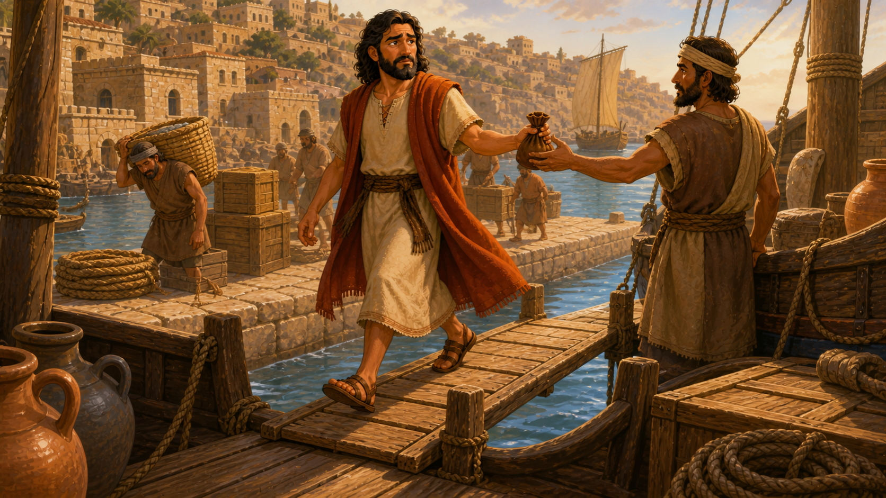
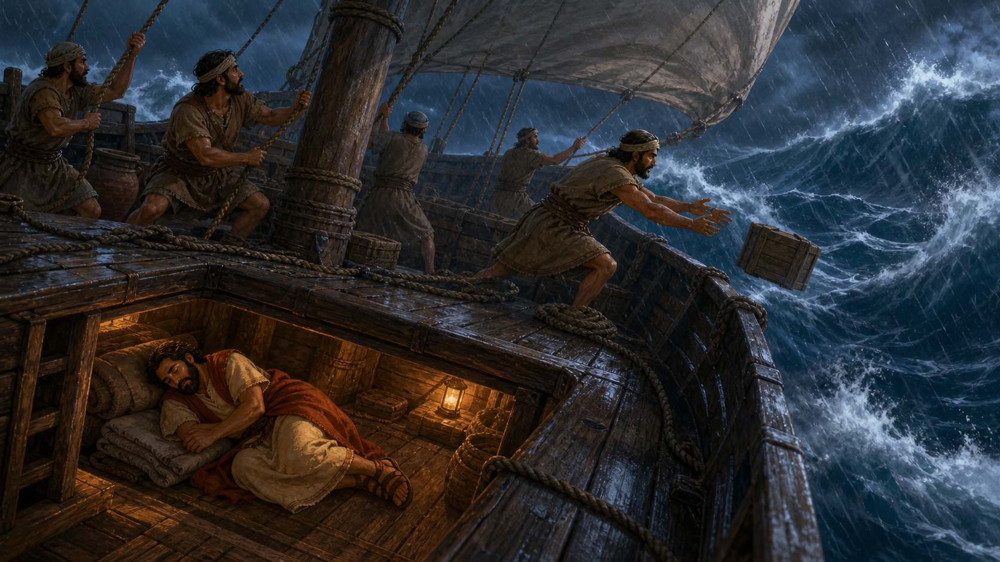

# The Runaway Prophet

## Lesson Brief

- **Series:** Adventures in the Bible
- **Subject/Theme:** Running from God's command brings danger, pain, and misery; God is merciful and calls sinners to repentance.
- **Bible Focus:** Jonah's call, rebellion, storm, time in the great fish, deliverance, and Nineveh's response.
- **Main Passage:** Jonah 1-3
- **Main Point:** Running from God brings danger, pain, and misery, but God is merciful to sinners who turn to Him.

## Memory Verse

> **Jonah 2:7**
> When my soul fainted within me I remembered the LORD: and my prayer came in unto thee, into thine holy temple.

## Lesson Outline

1. ### Introduction and Context

Several hundred years before Jesus was born Israel had trouble with another really big nation. This was the nation of Assyria. many nations were scared of Assyria, because Assyria was a dreadfully violent and mean country. They would take people from their homes. They would hurt them. They would destroy their houses and separate families. Their armies and rulers used terror and fear to get people to do what they wanted.

The capital city of Assyria was Nineveh. Nineveh was a very large city. The Bible says it had over 120,000 people, and it was so big that it would take three days to walk across. but Nineveh was also a very sad city. It was known for its wickedness, violence, lies, and robbery. Another prophet named Nahum would describe Nineveh as a bloody city.

Israel hated Assyria and Nineveh. They hated them because of how they treated them, because of how violent they were and how mean they were and the way they destroyed their homes and their families The people of Israel wanted Assyria and wanted Nineveh to be destroyed.

### 2. God Gave Jonah A Clear Command

**Main Passage:**

- **Jonah 1:1-2 (KJV)**

  > 1 Now the word of the LORD came unto Jonah the son of Amittai, saying,
  >
  > 2 Arise, go to Nineveh, that great city, and cry against it; for their wickedness is come up before me.

**Summary/Lesson:**

In Israel, God had certain people called prophets who would deliver his messages to his people. These messages would be very important because they would come from God and they would be instructions for the people to follow. A lot of times they would be warnings for people to stay away from doing wrong things, or they would be instructions to tell them to do certain things. Often, they would be messages of judgment that if they did not turn from their wickedness and obey God, that they would be punished. 

In Israel, there was a prophet named Jonah. God had a very specific message for Jonah to deliver, but it wasn't to the people of Israel, it was to the people of Nineveh. God wanted Nineveh to repent of their wickedness and to turn away from their evil deeds and to turn to God. And if they did that, he would forgive them. Otherwise, the city would be destroyed. 

 Jonah did not want to tell this message because Jonah, just like the rest of the Israelites, hated Nineveh and the Assyrians because of how they treated them.  Jonah knew very clearly what God wanted him to do. He wasn't confused. He didn't hear God incorrectly. He knew exactly what he was supposed to do. 

But Jonah decided not to obey. Jonah did not want Nineveh to repent of their sin. Jonah wanted Nineveh to be destroyed. He wanted God to judge Nineveh, not to forgive them. So Jonah decided to disobey God and not do what he was told. 

**Ecclesiastes 12:13 (KJV)** 

> Let us hear the conclusion of the whole matter: Fear God, and keep his commandments: for this is the whole duty of man.

**Practical Application for Children:**

- God tells us to care about people we may not like.
- We must not decide that someone is "too bad" for God to save.
- We should pray for people who are unkind, unfair, or difficult. We should witness to them, invite them to church, and tell them about Jesus.
- We should obey God even though it is something we don't want to do

### 3. Jonah Tried To Run Away From God

**Main Passage:**

- **Jonah 1:3 (KJV)**

  > But Jonah rose up to flee unto Tarshish from the presence of the LORD, and went down to Joppa; and he found a ship going to Tarshish: so he paid the fare thereof, and went down into it, to go with them unto Tarshish from the presence of the LORD.

**Summary/Lesson:**

 So here we see Jonah, a prophet of God, doing something very silly. As a prophet, you would think he would know that you can't run from God, that you can't hide from God, and that God isn't going to change His mind just because you decide to disobey Him. You and I know better, and He's certainly did too. 

 Jonah was simply being naughty and disobeying God. God gave him a clear command, and he was rebelling against what God wanted him to do. Instead of going towards Nineveh, he decided to go the other way. He got on a boat, going to a city far, far away, paid for it. and headed in the opposite direction. 

 He knew that he was doing wrong. He knew that he was disobeying God. God wanted him to go the other way, but Jonas said no. I'm sure every person he passed on his way to that boat reminded him of the people of Nineveh who would die and go to hell if he did not obey God. 

**Psalm 139:7-10 (KJV)** - No one can go where God is not present.

> 7 Whither shall I go from thy spirit? or whither shall I flee from thy presence?
>
> 8 If I ascend up into heaven, thou art there: if I make my bed in hell, behold, thou art there.
>
> 9 If I take the wings of the morning, and dwell in the uttermost parts of the sea;
>
> 10 Even there shall thy hand lead me, and thy right hand shall hold me.

**Practical Application for Children:**

- You cannot hide sin from God.
- Running from a problem, lying, blaming someone else, or sneaking around does not fix disobedience, it only makes it worse
- The best time to turn around and obey is now.

### 4. Jonah's Sin Brought A Terrible Storm

**Main Passage:**

- **Jonah 1:4-10 (KJV)**

  > 4 But the LORD sent out a great wind into the sea, and there was a mighty tempest in the sea, so that the ship was like to be broken.
  >
  > 5 Then the mariners were afraid, and cried every man unto his god, and cast forth the wares that were in the ship into the sea, to lighten it of them. But Jonah was gone down into the sides of the ship; and he lay, and was fast asleep.
  >
  > 6 So the shipmaster came to him, and said unto him, What meanest thou, O sleeper? arise, call upon thy God, if so be that God will think upon us, that we perish not.
  >
  > 7 And they said every one to his fellow, Come, and let us cast lots, that we may know for whose cause this evil is upon us. So they cast lots, and the lot fell upon Jonah.
  >
  > 8 Then said they unto him, Tell us, we pray thee, for whose cause this evil is upon us; What is thine occupation? and whence comest thou? what is thy country? and of what people art thou?
  >
  > 9 And he said unto them, I am an Hebrew; and I fear the LORD, the God of heaven, which hath made the sea and the dry land.
  >
  > 10 Then were the men exceedingly afraid, and said unto him, Why hast thou done this? For the men knew that he fled from the presence of the LORD, because he had told them.

**Summary/Lesson:**

 Boys and girls sometimes we might think that what God wants us to do is scary or sometimes it's something we don't want to do but no matter how scary it is or how much we don't want to do it. Disobeying God is always worse. Jonah was about to learn that the hard way. 

 Jonah got on that ship and started to sail away. And at first, I'm sure he thought everything was just fine. But it wasn't. Soon it started to rain, and the wind picked up. And before he knew it, there was a massive storm. The storm was so bad it began to tear the ship apart. The crew began throwing things overboard to keep it floating when they found him sleeping below deck. 

 And asked him to pray that they would survive the storm. Then they decided to do something called cast lots to figure out whose fault it was that they were in this horrible storm.  Sure enough, they figured out it was Jonah. Jonah confessed to them that he was running from God. And this terrified them even more. 

 You see boys and girls, if he had just obeyed God from the beginning, sure he would have had to do something he didn't want to do, but he would have escaped this horrible storm, would not be fearing his own death, and would not have endangered the lives of complete strangers. Something we must realize is that whenever we do wrong, it doesn't just affect us, but it always affects someone else. 

**Supporting Scriptures:**

- **Galatians 6:7 (KJV)** - We reap what we sow.

  > Be not deceived; God is not mocked: for whatsoever a man soweth, that shall he also reap.

- **Proverbs 28:13 (KJV)** - Hiding sin does not bring mercy; confessing and forsaking it does.

  > He that covereth his sins shall not prosper: but whoso confesseth and forsaketh them shall have mercy.

- **Psalm 107:23-28 (KJV)** - God is sovereign over the sea and storms.

  > 23 They that go down to the sea in ships, that do business in great waters;
  >
  > 24 These see the works of the LORD, and his wonders in the deep.
  >
  > 25 For he commandeth, and raiseth the stormy wind, which lifteth up the waves thereof.
  >
  > 26 They mount up to the heaven, they go down again to the depths: their soul is melted because of trouble.
  >
  > 27 They reel to and fro, and stagger like a drunken man, and are at their wits' end.
  >
  > 28 Then they cry unto the LORD in their trouble, and he bringeth them out of their distresses.

**Practical Application for Children:**

- Sin never stays as small as we think it will.
- Your disobedience can hurt your family, friends, class, or church.
- Do not be like Jonah and sleep through a problem you need to face.

**Illustration:**

- Use a toy boat in a pan or on a blue sheet while children make storm sounds.
- Pause suddenly and ask: "Why is this storm happening?"

### 5. Jonah Was Thrown Into The Sea

**Main Passage:**

- **Jonah 1:11-16 (KJV)**

  > 11 Then said they unto him, What shall we do unto thee, that the sea may be calm unto us? for the sea wrought, and was tempestuous.
  >
  > 12 And he said unto them, Take me up, and cast me forth into the sea; so shall the sea be calm unto you: for I know that for my sake this great tempest is upon you.
  >
  > 13 Nevertheless the men rowed hard to bring it to the land; but they could not: for the sea wrought, and was tempestuous against them.
  >
  > 14 Wherefore they cried unto the LORD, and said, We beseech thee, O LORD, we beseech thee, let us not perish for this man's life, and lay not upon us innocent blood: for thou, O LORD, hast done as it pleased thee.
  >
  > 15 So they took up Jonah, and cast him forth into the sea: and the sea ceased from her raging.
  >
  > 16 Then the men feared the LORD exceedingly, and offered a sacrifice unto the LORD, and made vows.

**Summary/Lesson:**

- Jonah told the sailors to throw him into the sea.
- The sailors tried hard to row back to land before doing it.
- When they threw Jonah overboard, the sea became calm.
- The sailors feared the LORD and offered a sacrifice to Him.
- Jonah's sin had brought him to a frightening, helpless place.

**Supporting Scriptures:**

- **Romans 6:23 (KJV)** - Sin earns death.

  > For the wages of sin is death; but the gift of God is eternal life through Jesus Christ our Lord.

- **Hebrews 9:27 (KJV)** - People must face God after death.

  > And as it is appointed unto men once to die, but after this the judgment:

- **Psalm 46:1 (KJV)** - God is our refuge and strength in trouble.

  > God is our refuge and strength, a very present help in trouble.

**Practical Application for Children:**

- Sin is serious, even when it begins with one wrong choice.
- We need more than our own strength or cleverness to escape sin.
- God can use even a hard consequence to get our attention.

**Illustration:**

- Have the "storm" stop instantly when a paper Jonah is removed from the toy boat.
- Ask: "Could Jonah swim away from God?"

### 6. God Prepared A Great Fish

**Main Passage:**

- **Jonah 1:17 (KJV)**

  > Now the LORD had prepared a great fish to swallow up Jonah. And Jonah was in the belly of the fish three days and three nights.

- **Jonah 2:1-10 (KJV)**

  > 1 Then Jonah prayed unto the LORD his God out of the fish's belly,
  >
  > 2 And said, I cried by reason of mine affliction unto the LORD, and he heard me; out of the belly of hell cried I, and thou heardest my voice.
  >
  > 3 For thou hadst cast me into the deep, in the midst of the seas; and the floods compassed me about: all thy billows and thy waves passed over me.
  >
  > 4 Then I said, I am cast out of thy sight; yet I will look again toward thy holy temple.
  >
  > 5 The waters compassed me about, even to the soul; the depth closed me round about, the weeds were wrapped about my head.
  >
  > 6 I went down to the bottoms of the mountains; the earth with her bars was about me for ever: yet hast thou brought up my life from corruption, O LORD my God.
  >
  > 7 When my soul fainted within me I remembered the LORD: and my prayer came in unto thee, into thine holy temple.
  >
  > 8 They that observe lying vanities forsake their own mercy.
  >
  > 9 But I will sacrifice unto thee with the voice of thanksgiving; I will pay that that I have vowed. Salvation is of the LORD.
  >
  > 10 And the LORD spake unto the fish, and it vomited out Jonah upon the dry land.

**Summary/Lesson:**

- The LORD prepared a great fish to swallow Jonah.
- Jonah spent three days and three nights in the fish's belly.
- He was alive, trapped, wet, miserable, and unable to save himself.
- Jonah prayed to the LORD from the belly of the fish.
- Jonah remembered that "Salvation is of the LORD."
- When God commanded, the fish vomited Jonah onto dry land.
- The fish was not a lucky accident; it was God's powerful mercy and discipline.

**Supporting Scriptures:**

- **Psalm 34:18 (KJV)** - The LORD is near to the brokenhearted.

  > The LORD is nigh unto them that are of a broken heart; and saveth such as be of a contrite spirit.

- **Lamentations 3:22-23 (KJV)** - God's mercies are new every morning.

  > 22 It is of the LORD'S mercies that we are not consumed, because his compassions fail not.
  >
  > 23 They are new every morning: great is thy faithfulness.

- **Matthew 12:40 (KJV)** - Jesus used Jonah's three days as a sign of His death, burial, and resurrection.

  > For as Jonas was three days and three nights in the whale's belly; so shall the Son of man be three days and three nights in the heart of the earth.

**Practical Application for Children:**

- When you have sinned, do not wait until everything feels better before praying.
- Tell God the truth, ask for mercy, and turn back to obey Him.
- God is able to reach you in the mess you made.

**Illustration:**

- Let the class count slowly to three as a "great fish" blanket or cardboard mouth covers a Jonah figure.
- Reveal Jonah on "dry land" and emphasize that God alone rescued him.

### 7. Nineveh Heard God's Warning And Turned

**Main Passage:**

- **Jonah 3:1-10 (KJV)**

  > 1 And the word of the LORD came unto Jonah the second time, saying,
  >
  > 2 Arise, go unto Nineveh, that great city, and preach unto it the preaching that I bid thee.
  >
  > 3 So Jonah arose, and went unto Nineveh, according to the word of the LORD. Now Nineveh was an exceeding great city of three days' journey.
  >
  > 4 And Jonah began to enter into the city a day's journey, and he cried, and said, Yet forty days, and Nineveh shall be overthrown.
  >
  > 5 So the people of Nineveh believed God, and proclaimed a fast, and put on sackcloth, from the greatest of them even to the least of them.
  >
  > 6 For word came unto the king of Nineveh, and he arose from his throne, and he laid his robe from him, and covered him with sackcloth, and sat in ashes.
  >
  > 7 And he caused it to be proclaimed and published through Nineveh by the decree of the king and his nobles, saying, Let neither man nor beast, herd nor flock, taste any thing: let them not feed, nor drink water:
  >
  > 8 But let man and beast be covered with sackcloth, and cry mightily unto God: yea, let them turn every one from his evil way, and from the violence that is in their hands.
  >
  > 9 Who can tell if God will turn and repent, and turn away from his fierce anger, that we perish not?
  >
  > 10 And God saw their works, that they turned from their evil way; and God repented of the evil, that he had said that he would do unto them; and he did it not.

**Summary/Lesson:**

- God gave Jonah the command again.
- This time Jonah went to Nineveh and preached God's warning.
- The people of Nineveh believed God and turned from their wicked way.
- God saw their repentance and showed mercy.
- The story ends by showing that God cares about sinners everywhere.

**Supporting Scriptures:**

- **Luke 15:7 (KJV)** - Heaven rejoices when one sinner repents.

  > I say unto you, that likewise joy shall be in heaven over one sinner that repenteth, more than over ninety and nine just persons, which need no repentance.

- **2 Peter 3:9 (KJV)** - God is not willing that any should perish.

  > The Lord is not slack concerning his promise, as some men count slackness; but is longsuffering to us-ward, not willing that any should perish, but that all should come to repentance.

- **Romans 10:13 (KJV)** - Whoever calls on the Lord shall be saved.

  > For whosoever shall call upon the name of the Lord shall be saved.

**Practical Application for Children:**

- God can save any sinner who comes to Him.
- Do not delay when God convicts you about sin.
- Tell others that Jesus can save them too.

**Illustration:**

- Give the class a simple "warning sign" and a "turn around" sign.
- Explain that repentance means turning from sin to God; it is not merely feeling sorry.

## Segue Into The Plan Of Salvation

- Jonah was trapped and could not rescue himself from the great fish.
- We are trapped by sin and cannot save ourselves by being good, going to church, or trying harder.
- Nineveh heard God's warning, believed God, and turned from their wickedness.
- Jesus died for our sins, was buried, and rose again.
- Like Jonah was in the fish for three days, Jesus was in the grave and then rose again; Jesus Himself connected Jonah's three days to this sign in Matthew 12:40.
- Salvation is of the LORD, not something we can earn.
- Invite children to admit their sin and trust Jesus Christ alone to save them.

## Main Applications For The Kids

- Obey God right away, even when you do not feel like it.
- Do not try to hide or run from sin; turn back to God.
- Remember that sin brings danger, pain, and misery.
- Ask God for mercy when you have disobeyed.
- Care about people God wants to save, even people you do not like.
- Trust Jesus alone for salvation.
