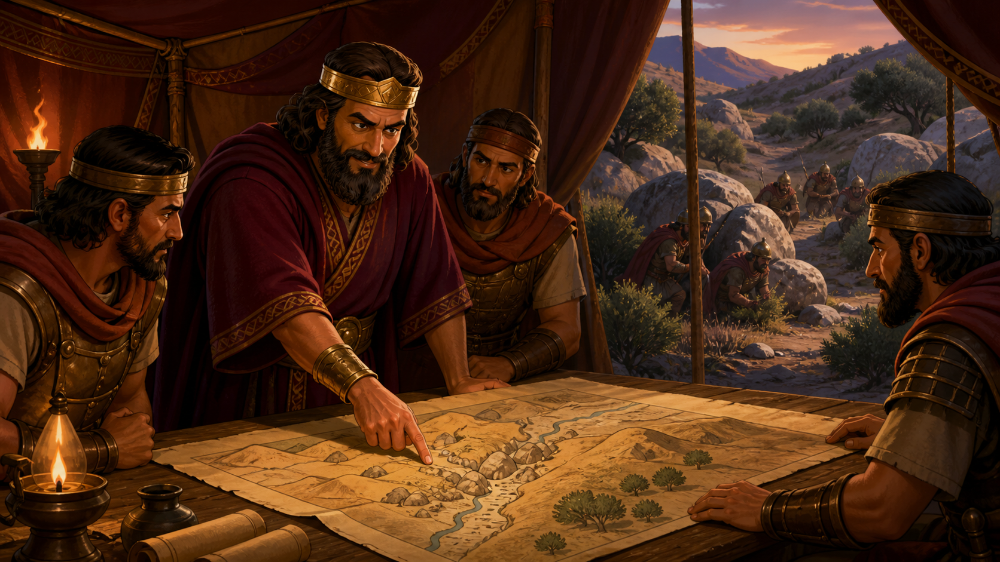
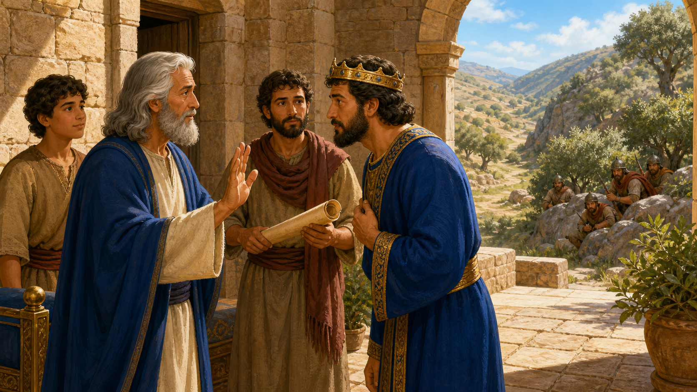
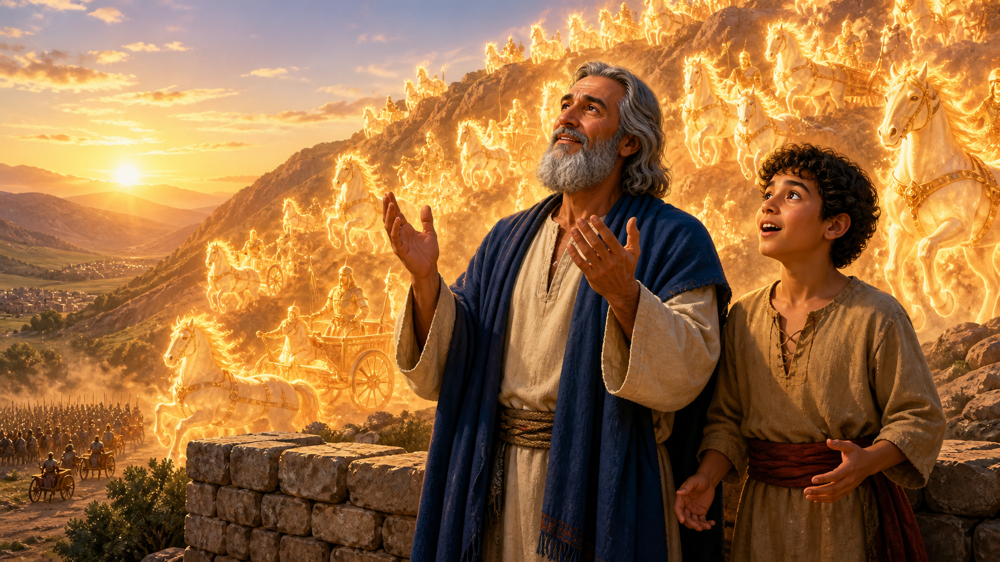
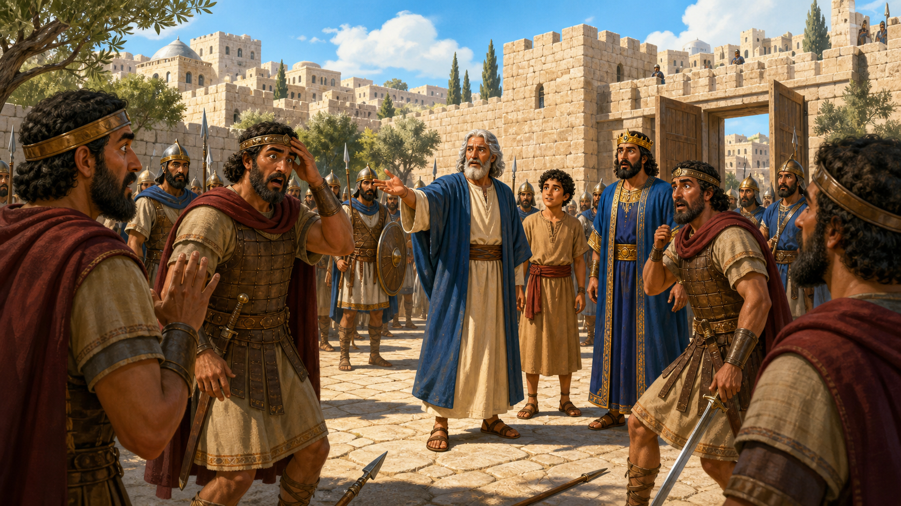
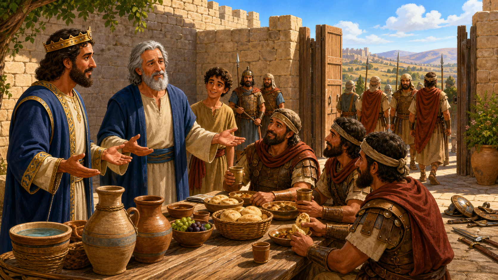

# The Invisible Army

## Lesson Brief

- **Series:** Adventures in the Bible
- **Subject/Theme:** Trusting the spiritual leaders God gives us when they warn and guide us from His Word.
- **Bible Focus:** Elisha reveals Syria's secret plans, God shows His fiery army around Dothan, and Israel's king follows Elisha's counsel.
- **Main Passage:** 2 Kings 6:8-23
- **Main Point:** God gives us spiritual leaders who use His Word to warn, guide, and protect us, so we should listen with a teachable heart.

## Lesson Outline

### 1. A Secret Ambush Was Planned

> **2 Kings 6:8**
> Then the king of Syria warred against Israel, and took counsel with his servants, saying, In such and such a place shall be my camp.

**Summary/Lesson:** The king of Syria (Ben-hadad) was at war with Israel. He met secretly with his advisers and generals and chose a place where his soldiers could hide and surprise Jehoram, the king of Israel. Jehoram could walk into the trap before he knew the enemy was there.

👉🏻 Build the danger for the children. Ask them to pretend to be soldiers hiding behind rocks, tents, and trees.

> **Proverbs 15:3**
> The eyes of the LORD are in every place, beholding the evil and the good.

### 2. The King Listened To A Warning He Could Not See

> **2 Kings 6:9-12**
> And the man of God sent unto the king of Israel, saying, Beware that thou pass not such a place; for thither the Syrians are come down. And the king of Israel sent to the place which the man of God told him and warned him of, and saved himself there, not once nor twice. Therefore the heart of the king of Syria was sore troubled for this thing; and he called his servants, and said unto them, Will ye not shew me which of us is for the king of Israel? And one of his servants said, None, my lord, O king: but Elisha, the prophet that is in Israel, telleth the king of Israel the words that thou speakest in thy bedchamber.

**Summary/Lesson:**  Now Elisha was one of the prophets that God had put in Israel. If you remember from last week, we talked about how a prophet was a special person that God gave messages to deliver to people. Well, this time God gave a message to Elisha to tell Jehoram, the king of Israel, that Ben-Hadad, the king of Syria, had set a trap for him. 

 Jehoram had a choice. He could have ignored Elisha's warning, thinking that being the king of Israel, he had power and riches to avoid trouble. He had specially trained guards to protect him and to watch over him, there was no way that he was going to get captured. 

Or he would take Elisha's warning seriously, knowing that he was still just a person and he could easily be tricked if it wasn't for the protection of God. 

Jehoram took the warning seriously. He watched the place and escaped the trap "not once nor twice." The wording means that God protected him this way several times.

The Syrian king became deeply troubled. He knew for sure one of his own servants was secretly helping Israel. He thought one of his special advisors or generals was a spy! However, one of his servants answered that Elisha, the prophet of God, told Israel's king about his plan. They knew the God blessed Elisha, and they knew the God could very probably warn Elisha about the danger.

**Practical Application for Children:** God gives children parents who teach His truth in the home. He gives the church pastors and teachers who watch for souls. These leaders can recognize dangers that a child or church member has not learned to see, such as a harmful friendship, dishonest habit, sinful video, cruel joke, or unwise online conversation. Listen carefully when they teach from the Bible. Ask questions with respect. Follow their wise direction.

### 3. The Syrian King Hunted The Prophet

> **2 Kings 6:13-14**
> And he said, Go and spy where he is, that I may send and fetch him. And it was told him, saying, Behold, he is in Dothan. Therefore sent he thither horses, and chariots, and a great host: and they came by night, and compassed the city about.

**Summary/Lesson:** The king of Syria did not like that Johoram had someone that could give him the ability to avoid traps so easily. He didn't like that God himself could help him. With God able to give messages to the king, there was no way that Ben-hadad would be able to capture King Jehoram. 

So instead of trying to capture King Jehoram, King Ben-hadad decided he was going to capture Elisha.  He ordered his servants to find the prophet. When they learned that Elisha was in Dothan, the king sent horses, chariots, and "a great host." This was far more soldiers than anyone would expect for one man. But Ben-Hadad decided that he was not going to let Elisha escape. 

The army traveled at night and surrounded the city of Dothan. Every path out of the city was covered. The Syrian king thought that taking Elisha would silence the warnings and make Israel easy to attack. It looked hopeless from inside the city. There was no way Elisha was going to escape.

**Practical Application for Children:** Speaking truth and doing right can bring pressure. A friend may become angry when you refuse to lie. Someone may mock you for obeying the Bible. Standing up for God can and will bring trouble your way, but was we'll see in a couple minutes, no amount of trouble is more powerful than God!

### 4. The Servant Saw Only The Enemy

> **2 Kings 6:15-16**
> And when the servant of the man of God was risen early, and gone forth, behold, an host compassed the city both with horses and chariots. And his servant said unto him, Alas, my master! how shall we do? And he answered, Fear not: for they that be with us are more than they that be with them.

**Summary/Lesson:** Elisha's servant rose early and went outside. He saw horses, chariots, and Syrian soldiers completely surrounding the city. He cried, "Alas, my master! how shall we do?" He could see the enemy surrounding him and he knew there was no way out. Surely he would die that day.

 But there was a verse that I think Elisha might have remembered that was written by a man named David. And I can imagine him thinking about this verse when he saw the massive army surrounding him:

> **Psalms 27:3**
> Though an host should encamp against me, my heart shall not fear: though war should rise against me, in this will I be confident.

 Elisha knew he could trust in God. He knew that if this was his time to die, then it was his time to go. But he also knew that if it wasn't, then no army, no matter how big it was, could kill him. 

So Elisha told his servant, "Fear not: for they that be with us are more than they that be with them." The servant may have wondered what Elisha meant. He could count the enemy soldiers. He could see no Israelite army coming to help. Elisha knew something that his servant had not yet seen. What do you think Elisha meant?

### 5. God Opened The Servant's Eyes

> **2 Kings 6:17-18**
> And Elisha prayed, and said, LORD, I pray thee, open his eyes, that he may see. And the LORD opened the eyes of the young man; and he saw: and, behold, the mountain was full of horses and chariots of fire round about Elisha. And when they came down to him, Elisha prayed unto the LORD, and said, Smite this people, I pray thee, with blindness. And he smote them with blindness according to the word of Elisha.

**Summary/Lesson:** Elisha prayed, "LORD, I pray thee, open his eyes, that he may see." And God answered. The servant saw that the mountain was covered in horses and chariots of fire. God's help was already there! The servant could now see why Elisha could say, "Fear not."

The Syrian army came down toward Elisha. They could not see the great host of God's special army, so they started coming to get Elisha. Elisha prayed again and asked God to make the enemy army blind. The LORD answered Elisha's prayer. The men who had surrounded the city could no longer see where they were or who was around them.

It doesn't matter how big the syrian army was, God' army was bigger and stronger, and the thing is, God didn't even need to use the army. All that had to happen was for God to make the enemy blind and they couldn't attack Elish at all.

> **Psalms 34:7**
> The angel of the LORD encampeth round about them that fear him, and delivereth them.

### 6. The Enemy Followed Elisha Into Samaria

> **2 Kings 6:19-20**
> And Elisha said unto them, This is not the way, neither is this the city: follow me, and I will bring you to the man whom ye seek. But he led them to Samaria. And it came to pass, when they were come into Samaria, that Elisha said, LORD, open the eyes of these men, that they may see. And the LORD opened their eyes, and they saw; and, behold, they were in the midst of Samaria.

**Summary/Lesson:** The blinded Syrians could not recognize Elisha. He told them that they were headed the wrong way and promised to lead them to the man they were seeking. Then Elisha led the whole force away from Dothan and into Samaria, Israel's capital city.

When they arrived, Elisha prayed, "LORD, open the eyes of these men, that they may see." Their sight returned. The soldiers looked around and discovered that they were standing in the middle of the Israelite army! A few hours earlier they had surrounded Elisha. Now they were surrounded. Their secret plan had failed, again, and they were completely captured. 

👉🏻 What do you think Israel's king would do with the captured enemy? If you were king, what would you do if you all of a sudden had the entire enemy army in your hands and they had tried to kill you several times? 

> **Proverbs 21:30-31**
> There is no wisdom nor understanding nor counsel against the LORD. The horse is prepared against the day of battle: but safety is of the LORD.

### 7. The King Listened Again And Mercy Brought Peace

> **2 Kings 6:21-23**
> And the king of Israel said unto Elisha, when he saw them, My father, shall I smite them? shall I smite them? And he answered, Thou shalt not smite them: wouldest thou smite those whom thou hast taken captive with thy sword and with thy bow? set bread and water before them, that they may eat and drink, and go to their master. And he prepared great provision for them: and when they had eaten and drunk, he sent them away, and they went to their master. So the bands of Syria came no more into the land of Israel.

**Summary/Lesson:** The king of Israel saw the captured Syrians and asked Elisha, "My father, shall I smite them? shall I smite them?" He wanted to know if he should kill the enemy soldiers. But that wasn't the right thing to do. Instead, Elisha instructed King Jehoram to set bread and water before the soldiers and feed them, and then send them home to their king.

Jehoram listened again. He prepared a giant feast for the enemy army. The hungry soldiers ate and drank. Then he let them go. They returned to Syria.

You might think, why would you let the enemy go like that? They're only gonna come back and destroy you later. But the thing is, at this point, even Ben-Hadad and the Syrian army learned their lesson. There was no catching Johoram or Elisha. Because God was on their side. So even though he could have killed them, Jehoram decided to have mercy and let them go. 

---

Elisha's first warning kept the king from walking into an ambush. His next instruction kept the king from acting in revenge. Spiritual authority, like parents or a teacher or a pastor, can protect us from dangers around us and sinful or dangerous decisions.  In this story the king was humble, and listened to the prophet, and did what he said, and it brought peace before two nations, and nobody had to die. 

## Segue Into The Plan Of Salvation

Israel's king listened when Elisha warned him about a danger he could not see. Faithful parents, pastors, and teachers give an even greater warning from God's Word. Every person has sinned, and sin brings judgment. Romans 3:23 says, "For all have sinned, and come short of the glory of God." Romans 6:23 says, "For the wages of sin is death."

> **Romans 10:9-10**
>
> That if thou shalt confess with thy mouth the Lord Jesus, and shalt believe in thine heart that God hath raised him from the dead, thou shalt be saved. For with the heart man believeth unto righteousness; and with the mouth confession is made unto salvation.

> **Ephesians 2:8-9**
>
> For by grace are ye saved through faith; and that not of yourselves: it is the gift of God: Not of works, lest any man should boast.

---

## Review Questions

1. Easy: What nation was fighting against Israel?
2. Easy: What was the name of the prophet who warned Israel's king?
3. Easy: What was the name of the king of Israel in this lesson?
4. Easy: In what city did the Syrians find Elisha?
5. Easy: What did the Syrian army use to surround Dothan during the night?
6. Easy: What did Elisha's servant see when he went outside in the morning?
7. Easy: What filled the mountain after God opened the servant's eyes?
8. Easy: What happened to the Syrian soldiers after Elisha prayed?
9. Medium: Why did the king of Syria think that one of his servants was a spy?
10. Medium: How did King Jehoram avoid the Syrian ambushes?
11. Medium: What did Elisha tell his frightened servant when the city was surrounded?
12. Medium: Where did Elisha lead the blinded Syrian army?
13. Medium: What did the Syrians discover when God opened their eyes in Samaria?
14. Medium: What did King Jehoram want to do with the captured soldiers?
15. Medium: What did Elisha tell Jehoram to do with them instead?
16. Medium: What happened after the Syrians ate, drank, and returned home?
17. Hard: How did listening to Elisha protect King Jehoram from both an enemy ambush and an angry decision?
18. Hard: What does the invisible army teach us about God when a danger looks overwhelming?
19. Hard: How should a child respond when a parent, pastor, or teacher gives a warning from God's Word that the child does not yet understand?
20. Hard: What danger does every sinner face, and what did Jesus do so that we can be saved?
